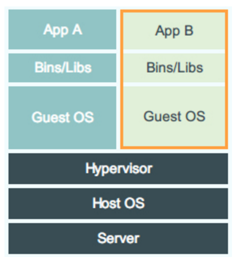
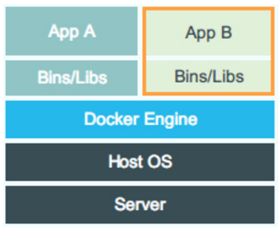

## 第一次作业
* 了解虚拟机和容器技术，用自己的话简单叙述、总结并对比； 

	__虚拟机技术：__ 虚拟机是一个模拟真实计算机的虚拟系统，它包括一台真正计算机除了硬件设备以外的部分：操作系统、库以及其上的应用。虚拟机利用软件模拟特定的硬件系统，依赖于hypervisor，生成操作系统的虚拟镜像，分配指定的资源，运行在一个独立的隔离环境。包含了虚拟硬件、内核以及用户空间，使得能够在同一个机器上运行多种操作系统。
	
	
	   
	__容器技术：__ 容器只包含应用以及所依赖的库和框架。容器位于硬件和操作系统的上方，直接搭载在主机操作系统上，与其直接通信，每个容器共享主机操作系统内核,在其上通过namespace等技术，将整个运行时环境（包括全部所需文件）一起打包隔离。
	
	 
	
	__对比：__ 虚拟机包含了操作系统和应用以及依赖的环境，容器只包含了应用以及依赖的环境；虚拟机依赖hypervisor，运行在hypervisor上，容器直接运行在宿主机内核上，需要容器引擎，如Docker Engine；虚拟机占有磁盘空间大，为GB量级，容器小，为MB量级；虚拟机启动速度满，分钟级，容器启动速度快，秒级；容器并发行更好，可以同时运行上百个，虚拟机最多几十个；性能上，虚拟机逊于宿主机，容器接近宿主机本地进程；虚拟机资源利用率较低，容器较高；容器相对虚拟机更轻量级、更快，管理和开发测试更简单；容器更易迁移。

* 利用LXC Python API编写程序，要求执行该程序会先创建并启动一个Debian系统容器，然后该程序会在容器根目录创建一个名为 Hello-Container的文件，并在文件中写入姓名和学号，最后该程序会停止当前容器。

	[代码在这里](Hello-Container.py)

