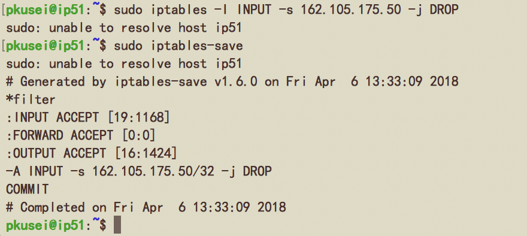

## 第三次作业

* <font size=4>叙述Linux网络包处理流程</font>

   

**基本概念：**  
netfilter有表和链两个维度，iptables包含4个表、5个链：
	
4个表:filter,nat,mangle,raw，默认表是filter（没有指定表的时候就是filter表）。表的处理优先级：raw>mangle>nat>filter。  
**filter：** 一般的过滤功能  
**nat：** 用于nat功能（端口映射，地址映射等）  
**mangle：** 用于对特定数据包的修改  
**raw：** 有限级最高，设置raw时一般是为了不再让iptables做数据包的链接跟踪处理，提高性能  
	
5个链：PREROUTING,INPUT,FORWARD,OUTPUT,POSTROUTING。  
**PREROUTING：** 数据包进入路由表之前  
**INPUT：** 通过路由表后目的地为本机  
**FORWARDING：** 通过路由表后，目的地不为本机  
**OUTPUT：** 由本机产生，向外转发  
**POSTROUTIONG：** 发送到网卡接口之前  

每个链中有若干规则，netfilter会依次按顺序将网络包与规则进行匹配，匹配成功后就按照该条规则处理网络包。若所有规则都没有匹配成功，则按照默认策略处理网络包。

**处理流程：**  
1. 网络包首先经过PREROUTING链，进入路由判断；  
2. 路由判断后确定是向该Linux主机发送的网络包，就进入INPUT链进行管控；  
3. 路由判断发现该包的目的不是该Linux主机，就进入FORWARD链进行转发；  
4. 响应客户端的要求，或者是Linux本机主动送出的网络包，透过路由判断，决定了输出的路径后，再透过OUTPUT链来传送；  
5. 流程3和流程4最后还要经由POSTROUTING链将网络包发送出去。

归纳起来：  
**接收：**PREROUTING -> INPUT  
**发送：**OUTPUT -> POSTROUTING  
**转发：**PREROUTING -> FORWARD -> POSTROUTING  

***

* <font size=4>在服务器上使用iptables分别实现如下功能并测试</font>

我将162.105.175.50的hostname改为了ip50，同时将162.105.175.51的hostname改为了ip51，在下面的实验截图中便于区分。另外，在下面的文字中以50和51代指这两台虚拟机。(在第二部分的实验中发现有时带sudo的指令会长时间无响应，将hostname改回pkucloud解决，所以有些截图的hostname为pkucloud)  
以下是51的iptables初始状态：  
  

**1）拒绝来自某一特定IP地址的访问**
 
在初始状态下50可以成功访问51：(使用了telnet、ssh、和nc三个指令进行了测试)  
  
在上图测试中的ssh我没有输密码，但已经可以看出是能够访问的。  
以下是利用iptables对51的修改：  
  
在INPUT表中对源为50的包进行DROP，从而拒绝50的访问。  
测试结果如下：  
  
之前的三个指令都没有相应，等的时间足够久的话，会有timeout，表明此时50已经不能访问51了。

**2）只开放本机的http和ssh服务，其余协议与端口均拒绝**

在初始状态下，各种操作可以成功完成。  
以下是利用iptables对51的修改：   

```
sudo iptables -A INPUT -p tcp --dport 22 -j ACCEPT  
sudo iptables -A OUTPUT -p tcp --sport 22 -j ACCEPT  
sudo iptables -A INPUT -p tcp --dport 80  -j ACCEPT  
sudo iptables -A OUTPUT -p tcp --sport 80  -j ACCEPT  
sudo iptables -P INPUT DROP  
sudo iptables -P FORWARD DROP  
sudo iptables -P OUTPUT DROP 
```

  
将INPUT的预设政策改为DROP，同时在INPUT表中，对目的端口为ssh和http的包进行ACCEPT，从而只开放本机的http和ssh服务，其余协议与端口均拒绝。  
测试结果如下：  
首先，50能够成功ssh到51。  
  
然后http没有找到好的测试方法，通过设置ssh -p 80来测试：  
  
发现80端口是connection refused，其他端口(22除外)都是timed out，所以80端口是开放的。  
最后，经测试，其他各种操作均不能成功。实现了要求功能。


**3）拒绝回应来自某一特定IP地址的ping命令**

在初始状态下50可以ping通51：  
  
以下是利用iptables对51的修改：  
  
在OUTPUT表中对本机发送的ping的回应包进行DROP，从而拒接回应50的ping。  
测试结果如下：  
  
50已经不能够ping通51了。

***

* <font size=4>解释路由与交换这两个概念的区别，介绍bridge, veth这两种Linux网络设备的工作原理</font>

	**路由与交换：**  
	简单来说，交换使用MAC地址根据MAC地址表转发数据帧，属于OSI的第二层数据链路层，由具有交换功能设备（例如交换机）实现；路由使用IP地址根据路由表转发数据包，属于OSI的第三层网络层，由具有路由功能设备（例如路由器）实现。  
	首先简单区分MAC地址和IP地址，MAC是物理地址，已经固化在了网卡的ROM中，不可以真正的更改；IP是逻辑地址，所有的网络互连设备以及终端设备其IP地址可以一直变化。各种网络设备在通信以及转发数据时，都会根据IP地址获取对应的MAC地址在对数据进行转发。  
	从地址表来看，交换地址表端口之间是不可以有回路的，需要用相应的生成树算法把回路端口阻塞掉；路由表可以有多条通路实现平衡负载，提高相应的可靠性。  
	另外，因为不可以根据MAC地址进行子网划分，交换实现的是特定网络内的数据交换；而IP地址由网络管理员进行分配，可以划分子网，路由实现在不同网络之间的数据转发。  
	路由使用软件处理，比较复杂，交换直接使用硬件处理，工作简单。

	**bridge：**  
	bridge是一个虚拟网络设备，具有网络设备的特征，可以配置IP、MAC地址等；同时，bridge是一个虚拟交换机，和物理交换机有类似的功能。bridge有多个端口，数据可以从任何端口进来，进来之后从哪个口出去和物理交换机的原理差不多，要看mac地址。
	
	**veth：**  
	VETH设备总是成对出现，送到一端请求发送的数据总是从另一端以请求接受的形式出现。创建并配置正确后，向其一端输入数据，VETH 会改变数据的方向并将其送入内核网络核心，完成数据的注入。在另一端能读到此数据。
	
***

* <font size=4>在fakeContainer的基础上为其增加网络功能</font>

**第一部分：**  
首先创建bridge和veth设备，构建出下图的结构  
  
指令依次是：  
在**host**中：  

```
# 创建bridge和veth
sudo ip link add name br0 type bridge   
sudo ip link add veth0 type veth peer name veth1  
sudo ip link set br0 up  
# 将bridge和veth设备相连
sudo ip link set dev veth0 master br0
sudo ip link set veth0 up
# 给bridge配上IP
sudo ip addr add 192.168.3.101/24 dev br0
# 将veth1添加到容器中，$pid可通过child_pid或ps获得
sudo ip link set veth1 netns $pid
```
在**container**中：

```
ip link set veth1 up
# 默认路由，将去往未知网络的数据包全部从接口veth1发出去
ip route add default dev veth1
# 给veth1配上IP
ip addr add 192.168.3.102/24 dev veth1
```

这个时候container和host就可以互相ping通了  
  
  
但是现在容器内还不能ping通外网  
  

接下来进行源地址转换SNAT，有两种方法  
第一种：  

```
# host
sudo iptables -t nat -A POSTROUTING -s 192.168.3.102/24 -j MASQUERADE
# container
route add default gw 192.168.3.101
``` 

第二种：

```
# host
sudo iptables -t nat -A POSTROUTING -s 192.168.3.102/24 -j SNAT --to 162.105.175.50 
# container
route add default gw 162.105.175.50
```

这个时候容器已经成功可以ping通外网了


**第二部分：**  
通过apt安装nginx，手动启动nginx服务  
通过iptables设置端口映射：

```
sudo iptables -t nat -A PREROUTING -p tcp --dport 8000 -j DNAT --to-destination 192.168.3.102:80
```

现在可以通过服务器的公网IP成功访问到该nginx服务器web服务。  


**第三部分：**  
流程：  
1. 外网的网络包进入宿主机的协议栈；  
2. 首先进入PREROUTING链，在PREROUTING的nat表匹配上之前设置好的规则，进行DNAT目的地址转换，转换为容器中的地址；  
3. 路由判断，目的地址不为主机的地址，进入FORWARD链和POSTROUTING链转发出去；  
4. 通过bridge进入容器的协议栈；  
5. 经由PREROUTING链和INPUT链，被监听80端口的nginx收到；  
6. nginx发出回复的网络包，经由OUTPUT链和POSTROUTING链发送出去；  
7. 再次进入宿主机的协议栈，转发；
8. 在POSTROUTING链nat表时，进行SNAT源地址转换，发送到外网。

***

