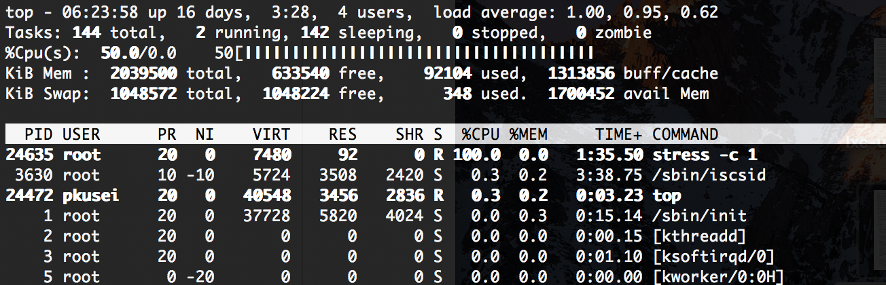
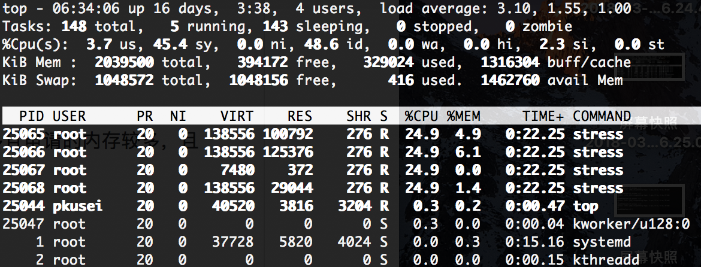
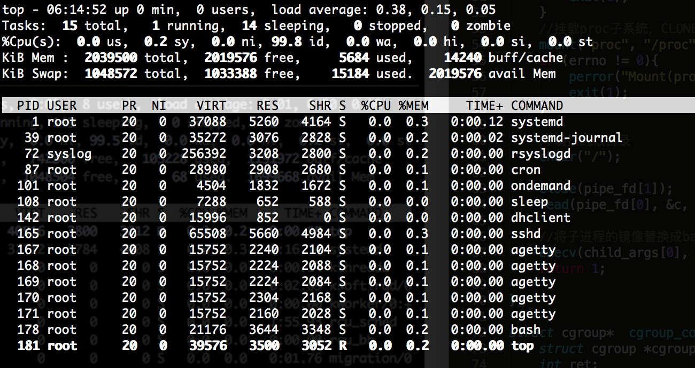

## 第二次作业
* 说明rootfs制作流程

	我阅读了/usr/share/lxc/template/lxc\-ubuntu的内容。  
	整个过程流程如下： 
	
	**1. 根据命令设置相应环境变量，配置相应的路径。**  
	
	**2. Install\_ubuntu \$rootfs \$release \$flushcache \$LXC\_CACHE\_PATH**  
	
	安装ubuntu，参数分别是：rootfs文件系统挂载点，release创建实例的版本，flushcache创建cache的目录，LXC\_CACHE\_PATH lxc的cache的路径。  
	在install_ubuntu中调用了download\_ubuntu和copy\_ubuntu。download\_ubuntu下载指定版本的系统到cache目录下。copy\_ubuntu从cache目录下拷贝到真正的根目录下。
	
	**3. download\_ubuntu \$cache \$arch \$release** 
	
	下载ubuntu，首先下载指定的linux发行版。下载完成后，修改sources.list文件，为升级和安装软件做准备。然后改变系统的根目录，执行update，更新sources.list。
	
	**4. copy\_ubuntu \$cache \$arch \$rootfs**

	拷贝ubuntu，使用rsync进行镜像的备份，实际相当于镜像的拷贝。
	
	**5. configure\_ubuntu \$rootfs \$name \$release \$user \$password**
	
	将镜像从cache拷贝到真正的rootfs。
	
	**6. copy\_configuration \$path \$rootfs \$name \$arch \$release**
	
	在根目录下生成config文件，并在fstab中挂载/proc和/fs。
	
	**7. post\_process \$rootfs \$release \$trim\_container \$packages**
	
	配置resolv.conf,并在新生成的镜像中安装一些必要的软件，如：lxcguest。
	
	**8. finalize\_user $user**
	
	创建用户/属组，配置ssh用户名和密码。

***
	
* 完善fakeContainer.c代码

	完善过后的代码见[这里](fakeContainer.c)。  
	修改部分如下：  
	  
	修改rootfs的路径。  
	   
	为fakeContainer设置资源上限1核心，512MB。
	
	
	**压力测试：**  
	使用stress压力测试软件在fakeContainer内进行内存、CPU压力测试，使用top指令进行监控。  
	
	**CPU压力测试：**  
	   
	依次产生1、2、3、4个进程对CPU进行压力测试，结果符合预期。具体结果如下：  
	  
	唯一一个进程独占cpu，cpu使用率100%。  
	  
	每个进程cpu使用率50%，总共100%。  
	  
	每个进程cpu使用率33.3%，总共100%。  
	  
	每个进程cpu使用率25%，总共100%。  
	
	**内存压力测试：**  
	   
	在1个内存分配进程下，依次分配512M、1024M、2048M进程测试。结果如下：  
	   
	512M的结果。分配内存在上限内，运行正常。  
	   
	1024M的结果。分配内存超过了上限，运行仍然正常。  
	   
	2048M的结果。分配内存大大超过了上限，进程停止运行。  
	   
	在多个（4个）内存分配进程下，依次总共分配512M、1024M、2048M进程测试。结果如下：  
	   
	512M的结果。分配内存在上限内，运行正常。  
	   
	1024M的结果。分配内存超过了上限，运行仍然正常。  
	  
	2048M的结果。分配内存大大超过了上限，进程停止运行。  
	
	**结果分析：**  
	在分配内存1024M大于设置的上限512M时，测试正常运行。程序没有被kill掉。通过对比可以发现，在512M时，swap分区used部分很少，而在1024M时，swap分区used部分有了明显的大幅增大。所以这个结果出现的原因是Linux有swap，即交换分区，它的主要功能是在内存不够用的时候，将部分内存上的数据交换到swap空间上，以便让系统不会因内存不够而导致oom或者更致命的情况出现。  
	在分配内存2048M远远大于设置的上限512M时，测试停止运行。程序被kill掉了。这是因为swap的空间也不够用了，于是内核将该进程给kill掉。  
	另外，可以通过修改配置文件memory.oom\_control，改变内存不够时的行为。当内核无法给进程分配足够的内存时，将会暂停该进程直到有空余的内存之后再继续运行。  
	同时，也可以修改memory.memsw.limit\_in\_bytes文件来限制swap+内存的额度。
	
***
	
* lab 1在代码方面需要从哪些方面进行提高

	* 容器的初始进程：  
	   
	在lxc容器中的top指令。  
	   
	在fakeContainer中的top指令。  
	通过对比可以看出，lxc容器中pid=1的初始进程为systemd，这是系统管理守护进程，传统linux系统启动过程由init进程处理，systemd引入了并行启动的概念，相比init优化了很多。fakeContainer中pid=1的初始进程为bash。  
	另外，还可以看出，真正的容器在用户没有进行操作是就已经有了一些进程。fakeContainer内只有pid=1的bash进程。  
	所以，fakeContainer需要在启动过程上进行修改。引入启动进程，并创建真正的容器需要的一系列进程。

	* host访问容器：  
	fakeContainer只能在运行程序后进入容器进行访问及操作。  
	lxc容器可以使用lxc-attach、lxc-console来访问进入容器，可以使用lxc-execute在容器中执行指令。可以通过一些API（如python API）来访问、操作容器。同时可以使用lxc-start，lxc-freeze等等对容器进行管理，使用lxc-monitor、lxc-ls等等来查询、监控容器。另外，lxc容器还可以使用ssh方法访问。  
	这些都是fakeContainer缺少的，需要提高的。

	* 资源隔离：  
	fakeContainer通过添加cgroup子系统，为容器设置资源上限。通过创建新的namespace，实现资源的隔离。但是相比lxc，对资源的隔离是不够的。比如，下图是在host中执行top指令：  
	  
	可以发现，在host中Mem和Swap的情况和fakeContainer中是几乎一样，和lxc中有很大的区别，这说明lxc容器真正实现了资源隔离，但fakeContainer的资源隔离还不够。

	* 网络栈：  
	fakeContainer还没有配置网络栈，不存在网络设备。
	
	* 异常处理及安全性  
	fakeContainer需要增加相应的异常处理函数，对权限进行更精确的控制，来保障容器的安全性及健壮性。