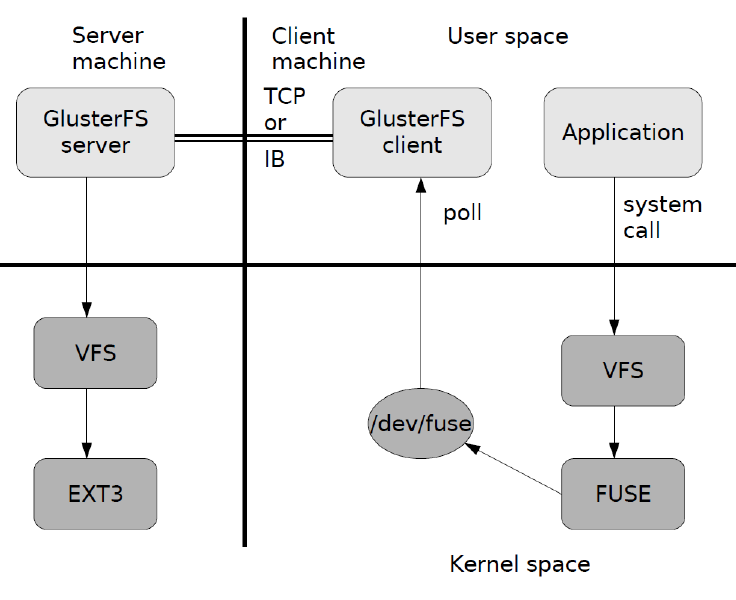
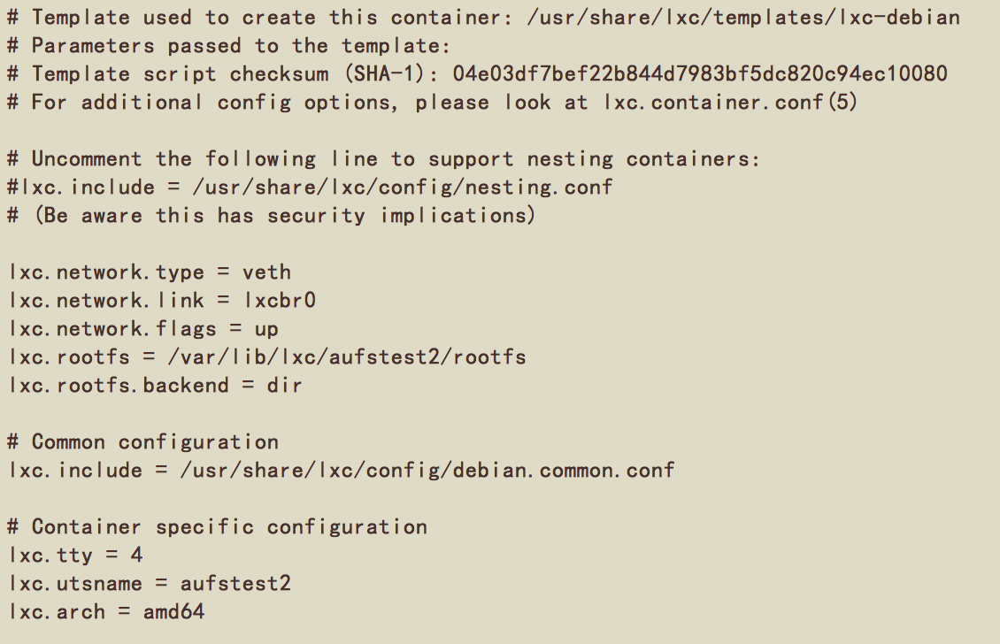
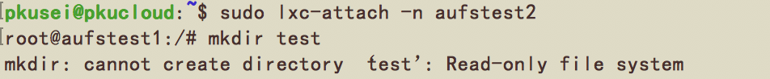
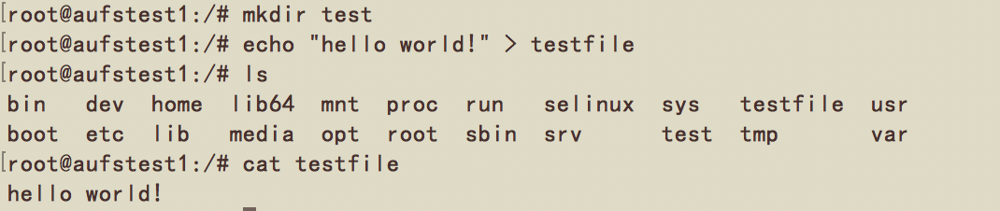
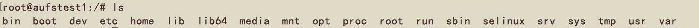
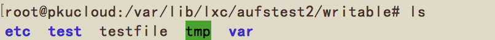

## 第五次作业

* **模拟Raft协议工作的一个场景并叙述处理过程**

	下面的网页很好的模拟了Raft协议的工作场景：  
	[http://thesecretlivesofdata.com/raft/](http://thesecretlivesofdata.com/raft/)
	
	**Raft协议处理过程：**  
	每一个节点有三种状态：  
	* **leader**  
	一般正常情况下只有一个leader，其他的都是follower。  
	leader处理所有客户端调用请求，如果客户端连的是follower，由follower转给leader
	* **follower**  
	follower 是个被动角色：只对leader以及candidate的请求进行响应
	* **candidate**  
	作为leader的候选
	
	主要的处理过程分为两个部分：  	
	**leader election（领导人选举）**  
	raft采用心跳机制去触发leader选举。leader 会周期的发送心跳给所有的follower状态的节点，以维护自己的leader角色。如果一个follower节点在超过一个election timeout的时间内未收到心跳会认为没有可用的leader，会开始选举一个新的leader。开始一次选举，follower节点将当前的term加1，并且转化成candidate。紧接着会给自己投一票，同时会并行的给其他节点发送RequestVote RPCs。candidate状态的节点会一直处于该状态直到一下任何一点发生会触发candidate节点改变状态的任意条件：1. 赢得选举成为leader；2. 获得大多数投票在一个term内
其他节点成为leader；3. 一段时间后，没有节点选举胜出。  
	最开始所有节点都是follower。	
	**log replication（日志复制）**  
	leader产生后，开始接受客户端的请求。客户端的每次请求都包含有一个要在所有状态机rsm上执行的命令command。leader将这些command做为新的log条目追加到自己的日志当中，然后并行分发AppendEntries RPCs到其他节点使其复制这个日志条目。当这个日志条目被大多数节点安全的复制后，leader会将该条目应用到自己的状态机中进行执行操作，然后在返回给客户端。leader先commit然后在rsm执行操作，最后在返回给调用方。如果follower节点crash或执行的比较慢或网络丢包，leader或一直重试发送AppendEntries RPCs(甚至在已经对客户端进行了响应后，仍然会重试)直到所有follower节点都存储这些日志条目。
	 
	另外，Raft还有一些保证安全性的处理。

* **GlusterFS和AUFS两种文件系统的工作原理和特点以及使用方式**

	**GlusterFS：**
	
	GlusterFS是Scale-Out存储解决方案Gluster的核心，它是一个开源的分布式文件系统，具有强大的横向扩展能力，通过扩展能够支持数PB存储容量和处理数千客户端。GlusterFS借助TCP/IP或InfiniBandRDMA网络将物理分布的存储资源聚集在一起，使用单一全局命名空间来管理数据。  
	Glusterfs是一个无中心的文件系统，不用考虑单点故障。
	
	**特点：**  
	* 扩展性和高性能  
	GlusterFS利用双重特性来提供几TB至数PB的高扩展存储解决方案。Scale-Out架构允许通过简单地增加资源来提高存储容量和性能，磁盘、计算和I/O资源都可以独立增加，支持10GbE和InfiniBand等高速网络互联。Gluster弹性哈希（ElasticHash）解除了GlusterFS对元数据服务器的需求，消除了单点故障和性能瓶颈，真正实现了并行化数据访问。
	* 高可用性  
	GlusterFS可以对文件进行自动复制，如镜像或多次复制，从而确保数据总是可以访问，甚至是在硬件故障的情况下也能正常访问。自我修复功能能够把数据恢复到正确的状态，而且修复是以增量的方式在后台执行，几乎不会产生性能负载。GlusterFS没有设计自己的私有数据文件格式，而是采用操作系统中主流标准的磁盘文件系统（如EXT3、ZFS）来存储文件，因此数据可以使用各种标准工具进行复制和访问。
	* 弹性卷管理  
	数据储存在逻辑卷中，逻辑卷可以从虚拟化的物理存储池进行独立逻辑划分而得到。存储服务器可以在线进行增加和移除，不会导致应用中断。逻辑卷可以在所有配置服务器中增长和缩减，可以在不同服务器迁移进行容量均衡，或者增加和移除系统，这些操作都可在线进行。文件系统配置更改也可以实时在线进行并应用，从而可以适应工作负载条件变化或在线性能调优。  
	* 完全软件实现
	* 完整的存储操作系统栈
	* 用户空间实现
	* 模块化堆栈式架构
	* 原始数据格式存储

	**数据访问流程：**  
	  
	用户通过glusterfs的mount point来读写数据，被递交给本地linux系统的VFS来处理，VFS将数据递交给FUSE内核文件系统，fuse文件系统则是将数据通过/dev/fuse这个设备文件递交给了glusterfs client端，最终通过网络和server通讯。
	
	**AUFS：**
	
	AUFS是一种Union File System，所谓UnionFS就是把不同物理位置的目录合并mount到同一个目录中。  
	AUFS有所有Union FS的特性，把多个目录，合并成同一个目录，并可以为每个需要合并的目录指定相应的权限，实时的添加、删除、修改已经被mount好的目录。而且，还能在多个可写的branch/dir间进行负载均衡。  
	被union的目录（分支）的相关权限：  
	rw：表示可写可读read-write。  
	ro：表示read-only，如果你不指权限，那么除了第一个外ro是默认值，对于ro分支，其永远不会收到写操作，也不会收到查找whiteout的操作。  
	rr：表示real-read-only，与read-only不同的是，rr标记的是天生就是只读的分支，这样，AUFS可以提高性能，比如不再设置inotify来检查文件变动通知。  
	挂载只需要选择好相应的参数，调用mount命令即可：
	
	```
	mount -t aufs -o dirs=./Branch-0:./Branch-1:./Branch-2 none ./MountPoint
	```

* **安装配置GlusterFS，启动容错机制，将配置好的分布式文件系统挂在到LXC容器里**

	

* **使用联合文件系统来为LXC提供镜像服务**

	首先，创建一个容器aufstest1：
	
	```
	sudo lxc-create -t debian -n aufstest1
	```
	
	然后在lxc路径下创建文件夹，将aufstest1只读挂载上去：
	
	```
	# pwd=/var/lib/lxc
	mkdir aufstest2
	mkdir aufstest2/rootfs
	mount -t aufs -o dirs=/var/lib/lxc/aufstest1/rootfs/=ro none /var/lib/lxc/aufstest2/rootfs
	# 修改配置文件
	vim config 
	```
	
	
	
	通过lxc-attach进入aufstest2容器，经测试，不能够修改里面的内容。  
	  
	这是不符合要求的，同样，把aufstest1的权限设置为rw也是不合理的。
	
	所以，另外建一个文件夹设置权限为rw，就相对于是提供了一层可写层。
	
	```
	# pwd=/var/lib/lxc/aufstest2/
	mkdir writable
	mount -t aufs -o dirs=/var/lib/lxc/aufstest2/writable/=rw:/var/lib/lxc/aufstest1/rootfs/=ro none /var/lib/lxc/aufstest2/rootfs
	```
	
	测试结果如下：  
	  
	能够修改容器中的内容。  
	
	原本的容器中内容没有被修改。  
	  
	新增的内容出现在writable文件夹中。
	
	实验结果符合要求。