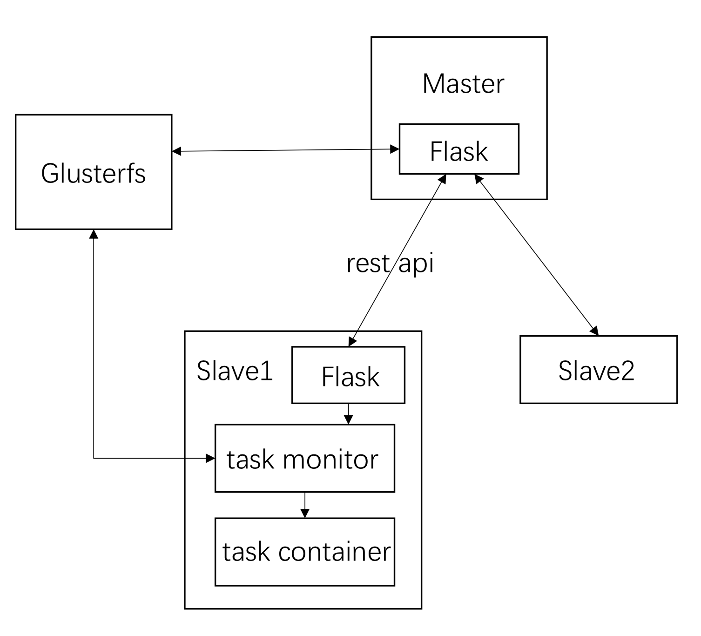

## 第六次作业

**架构设计：**  
master向用户提供的API接口通过flask实现，master与slave之间的通信也使用flask实现。  
所有任务的相关信息存储在glusterfs上，任务的等待队列和各slave状态维护在master上。  
用户提交任务后，master将任务信息存储在glusterfs上，调度选择空闲的slave，将task_id发给该slave，slave启动一个监控进程，该进程在glusterfs中读取对应任务的信息后在容器中执行指令，并更新相应状态，执行结束后告诉master。

如下图：  


接口：  
提交任务：post http://162.105.175.73/job/task  

```
{
	"name" : "my test task",
    "commandLine": "sleep 20 && echo 10",
    "packagePath": "/nfs/my-test.py",
    "resource": {
    	"cpu": "0",
		"memeory": "512M"
    },
    "maxRetryCount": "0",
    "timeout": "21600"
}
```

查询任务状态：get http://162.105.175.73/job/status/\<task_id>

杀死任务：post http://162.105.175.73/job/kill

```
{
	"task_id": "test5"
}
```