## 第四次作业

* **叙述以下三种情况下容器通信的网络处理过程**

	**1）同一host上同一子网内的两容器**

	新建两个容器，初始的ip分别为 10.0.3.12 和 10.0.3.84 ，在同一个子网内，利用traceroute指令，发现直接就到了10.3.0.83，没有经过网关。从tcpdump中可以看出，先发送了ARP包，找到目标MAC地址后，直接发送数据包。  
	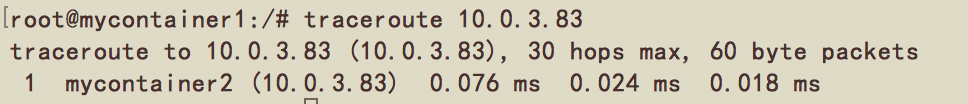  
	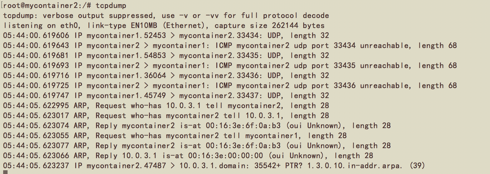
	
	**2）同一host上不同子网内的两容器**
	
	经过修改config文件，两个容器的ip变成了如下：  
	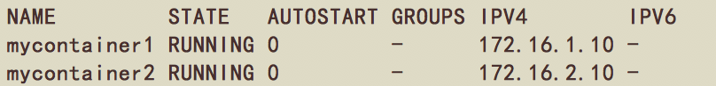  
	正常情况下这个过程是：容器1（172.16.1.10）现将数据包发给它的网关（172.16.1.1），该网关再将数据包发往容器2所在的网关（172.16.2.1），最后在发往容器2（172.16.2.10）。  
	
	如果加了tag，实验结果如下：  
	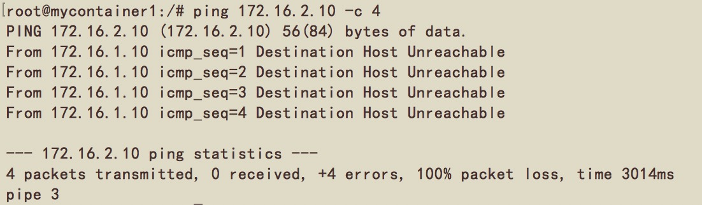  
	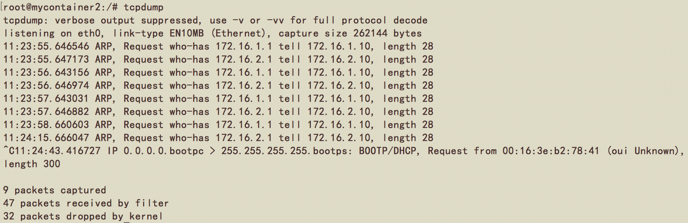  
	两个容器之间不能够通信。  
	
	**3）通过gre隧道相连的两个host上同一子网内的两容器**
	
	由容器1发出的数据包经解析发现目标地址需要经过隧道才能到达，gre隧道对报文进行封装，加上remote\_ip和local\_ip，经由host1发送出去，到达host2，gre解掉之前加上的的报头，传给容器2。  
	实验结果如下：  
	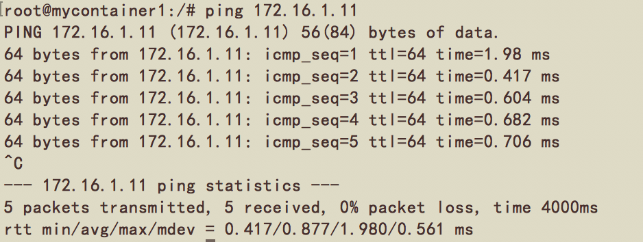  
	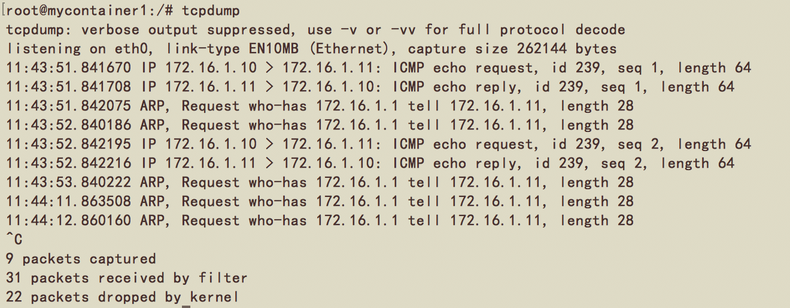
	
* **vlan技术原理**

	**原理：**  
	VLAN，虚拟局域网，遵循IEEE802.1Q协议。是一种将局域网设备从逻辑上划分成一个个网段，从而实现虚拟工作组的数据交换技术。  
	一个交换机所有的端口都在同一个广播域，任何一个端口发送的广播报文都会被发送到所有端口。这样显然不利于网络的隔离，还有可能会出现网络风暴（如arp等报文）。VLAN通过将一个交换机上的端口划分到不同的VLAN，收到广播帧后，只转发到同一VLAN的其他端口，从而分割了广播域。  
	不同VLAN间的通信叫做，VLAN间路由，可以使用普通的路由器，也可以使用三层交换机。
	
	**vlan在用户隔离数量上的限制：**  
	802.1Q在数据帧中占4个字节，包含了2个字节的标签协议标识（TPID）和2个字节的标签控制信息（TCI）。  
	TPID（Tag ProtocolIdentifier）是IEEE定义的新的类型，表明这是一个加了802.1Q标签的帧。TPID包含了一个固定的值0x8100。  
	TCI是包含的是帧的控制信息，它包含了下面的一些元素：  
	Priority：这3 位指明帧的优先级。一共有8种优先级，0－7。IEEE 802.1Q标准使用这三位信息。  
	Canonical Format Indicator( CFI )：CFI值为0说明是规范格式，1为非规范格式。它被用在令牌环/源路由FDDI介质访问方法中来指示封装帧中所带地址的比特次序信息。  
	VLAN Identified( VLAN ID ):这是一个12位的域，指明VLAN的ID，取值范围为0～4095，一共4096个，由于0 和4095 为协议保留取值，所以VLAN ID 的取值范围为1～4094每个支持802.1Q协议的交换机发送出来的数据包都会包含这个域，以指明自己属于哪一个VLAN。  
	由协议克制，最多可以有4094个VLAN，当需要隔离的域数量过多时，会受到这个限制。

* **vxlan技术及与gre技术的差异**

	VXLAN(Virtual eXtential LAN)，虚拟可拓展局域网。通过将VM或物理服务器发出的数据包封装在UDP中，并使用物理网络的IP/MAC作为报文头进行封装，然后在IP网络上传输，到达目的地后由隧道终结点解封装并将数据发送给目标虚拟机或物理服务器。vxlan报文格式相对传统的vlan更复杂，如下：  
	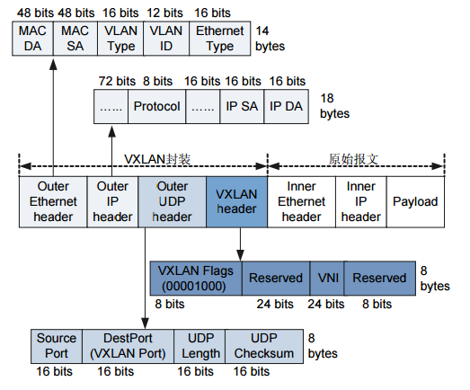  
	相比于传统的vlan，vxlan有以下优点：
	
	1. 	比传统vlan数量多：传统vlan支持4094个逻辑网络，vxlan支持1600多万个逻辑网络
	2. 可以跨越三层网络，限制二层广播域
	3. 可以支持跨物理子网虚拟机迁移
	4. 不需扩大交换机MAC表

	GRE和VXLAN都是用于封装其它协议的两种协议，都是用三层协议封装二层协议，都解决了VLAN规模固定的问题，不再局限于4094个。同时也有不同： 
	 
	1. 	为了提供描述带宽利用率粒度的流，传输网络需要使用GRE头，但是这导致GRE不能兼容传统负载均衡，这是GRE与VXLAN相比最大的区别也是最大的不足。  
	2. 	GRE没有采用标准传输协议（TCP/UDP），而是借助通用路由封装协议（GRE）。VXLAN是将数据包封装在UDP中。  
	3. 	VXLAN数据包比较大，需要借助支持大型帧的传输网络才能支持数据包规模的扩展。  
	4. 	VXLAN避免了GRE的点对点必须有连接的缺点。  
	5. 	GRE不需要依赖泛洪和IP组播进行学习，而是以一种更灵活的方式进行广播，但是这需要依赖硬件/供应商。  
	6. 	GRE支持减小数据包最大传输单元以减小内部虚拟网络数据包大小，不需要要求传输网络支持传输大型帧。

* **构建两个隔离的lxc容器集群**

	本次实验在 162.105.175.73 和 162.105.175.74 两台机器上完成。  
	首先是在 **162.105.175.73** 上的操作。  
	添加网桥：
	
	```
	sudo ovs-vsctl add-br br0
	sudo ip link set br0 up
	```
	
	修改已创建容器的config文件：  
	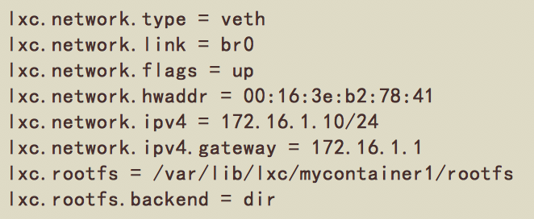
	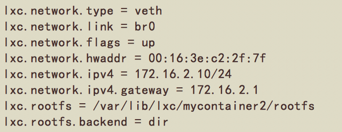  
	
	将网卡挂载到网桥上：（要么就要给br0加上IP，不然没法里外ping通，应该也可以直接给veth加上IP）
	
	```
	sudo ovs-vsctl add-port br0 port1 -- set interface port1 type=internal
	sudo ovs-vsctl add-port br0 port2 -- set interface port2 type=internal
	sudo ip addr add 172.16.1.1/24 dev port1
	sudo ip addr add 172.16.2.1/24 dev port2
	sudo ip link set port1 up
	sudo ip link set port2 up
	```
	
	给端口配置tag：
	
	```
	sudo ovs-vsctl set port port1 tag=11
	sudo ovs-vsctl set port port2 tag=22
	```
	
	建立gre隧道：
	
	```
	sudo ovs-vsctl add-port br0 gre0 -- set interface gre0 type=gre options:remote_ip=162.105.175.74
	```

	enable ip forward in /etc/sysctl.conf：
	
	```
	sudo iptables -t nat -A POSTROUTING -s 172.16.1.0/24 -j MASQUERADE
	sudo iptables -t nat -A POSTROUTING -s 172.16.2.0/24 -j MASQUERADE
	```
	
	然后是在 **162.105.175.74** 上的操作。
	
	```
	sudo ovs-vsctl add-br br0
	sudo ip link set br0 up
	sudo ovs-vsctl add-port br0 port3 -- set interface port3 type=internal
	sudo ip addr add 172.16.1.1/24 dev port3
	sudo ip link set port3 up
	sudo ovs-vsctl set port port3 tag=11
	sudo ovs-vsctl add-port br0 gre0 -- set interface gre0 type=gre option:remote_ip=162.105.175.73
	```
	
	修改已创建容器的config文件：  
	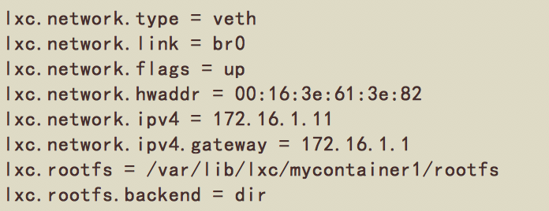  
	
	下面是现在的ovs的网络状态（左边 162.105.175.73，右边 162.105.175.74）：  
	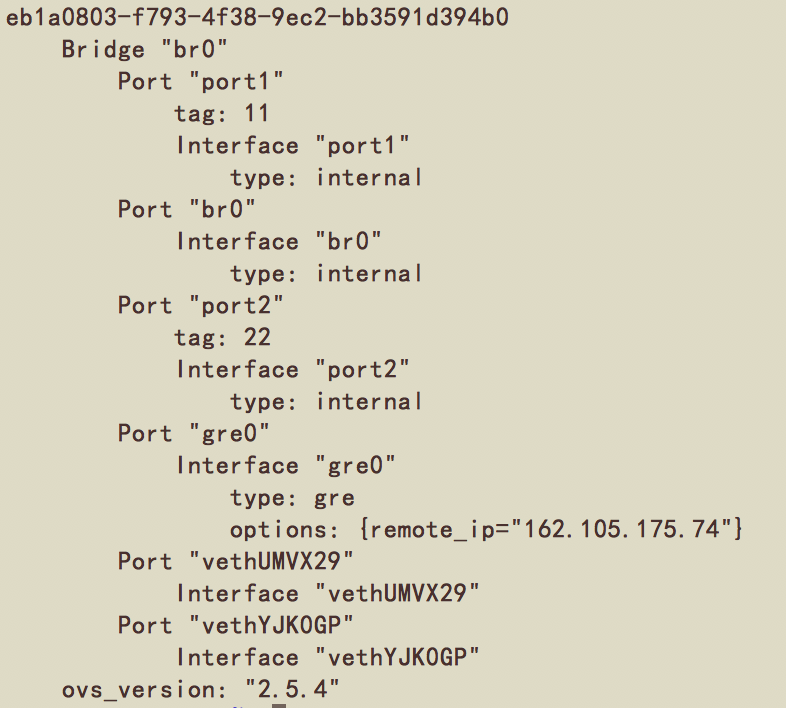
	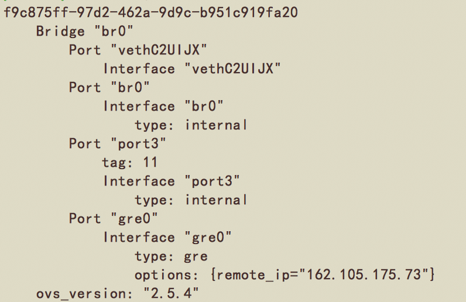
	
	以下是测试结果：  
	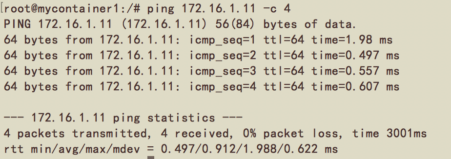  
	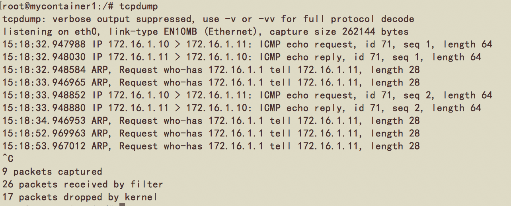  
	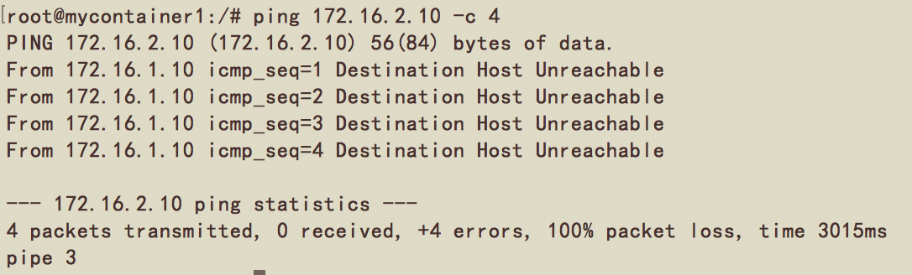  
	
	172.16.1.10 能ping通 172.16.1.11，不能ping通 172.16.2.10。实验结果符合预期。
	
* **对容器集群的网络进行流量控制**

	利用QoS配置ingress policing对容器集群的网络进行流量控制。  
	ingress\_policing\_rate：为接口最大收包速率，单位kbps，超过该速度的报文将被丢弃，默认值为0表示关闭该功能；  
	ingress\_policing\_burst：为最大突发流量大小，单位kb。默认值0表示1000kb，这个参数最小值应不小于接口的MTU，通常设置为ingress\_policing\_rate的10%更有利于tcp实现全速率；  
	
	设置最大收包速率为1Mbps：
	
	```
	sudo ovs-vsctl set interface port1 ingress_policing_rate=1000
	sudo ovs-vsctl set interface port1 ingress_policing_burst=100
	```
	
	利用iperf命令进行测试。在测试时发现如果某个端口添加了tag后就不能ping通其他ip，如容器（172.16.1.10）加了tag=11后就不能ping通宿主机（162.105.175.73）。所以在测试时，将port1的tag去掉了。    
	在宿主机上：
	
	```
	iperf3 -s
	```
	
	在容器内：  
	
	```
	iperf -c 162.105.175.73  -d -t 30
	```
	
	测试结果如下：  
	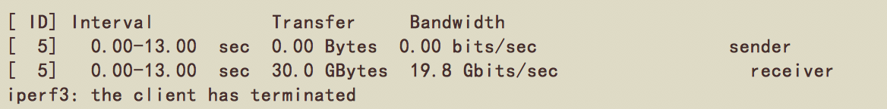  
	初始状态。  
	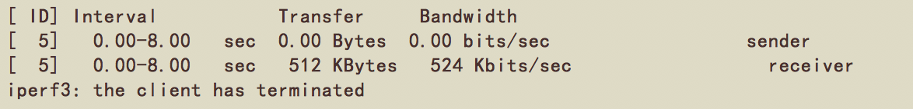  
	加了流量控制后。  
	可以明显看到流量受到了限制。